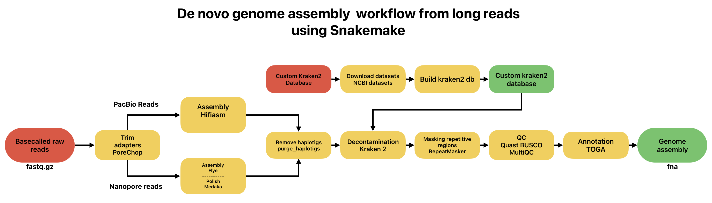

# De novo genome assembly of mammalian species from Oxford Nanopore reads workflow

## Intro
This workflow is based on the one used in _De Novo Genome Assembly for an Endangered Lemur Using Portable Nanopore Sequencing in Rural Madagascar_(Hauff et. all, 2025).

## Workflow
### Pipeline structure



### Project structure
```bash
.
├── config.yaml
├── data
├── envs
│   ├── annotation.yaml
│   ├── assembly.yaml
│   ├── decontamination.yaml
│   ├── masking.yaml
│   ├── polish.yaml
│   ├── qc.yaml
│   ├── rm_haplotigs.yaml
│   └── trim_adapters.yaml
├── logs
├── README.md
├── results
├── rules
│   ├── annotation.smk
│   ├── assembly.smk
│   ├── custom_k2_db.smk
│   ├── decontamination.smk
│   ├── masking.smk
│   ├── polish.smk
│   ├── qc.smk
│   ├── rm_haplotigs.smk
│   └── trim_adapters.smk
├── scripts
│   └── reset.sh
├── setup.sh
├── snakefile
└── workflow.sh
```	

### Depedencies
- **Flye**
- **Hifiasm**
- **Porechop**
- **Medaka**
- **Purge_dups**
- **RepeatMasker**
- **QUAST**
- **BUSCO**
- **TOGA**
- **Kraken 2**
- **Seqkit**
- **NCBI Datasets** (_Optional_)
- **BlobTolkit** (_Optional_)

## Installation

## Acknowledgements

All data used for the development of this workflow were provided by the
**Institute of Marine Biology, Biotechnology and Aquaculture (IMBBC)**
of the **Hellenic Centre for Marine Research (HCMR)**, Heraklion, Crete.
This workflow was developed and executed on the **Zorbas HPC** infrastructure of IMBBC-HCMR.

## References
- Hauff, L., Rasoanaivo, N.E., Razafindrakoto, A., Ravelonjanahary, H., Wright, P.C., Rakotoarivony, R. and Bergey, C.M. (2025), De Novo Genome Assembly for an Endangered Lemur Using Portable Nanopore Sequencing in Rural Madagascar. Ecol Evol, 15: e70734. [https://doi.org/10.1002/ece3.70734](https://doi.org/10.1002/ece3.70734)
- Bekavac M, Coimbra R, Busa VF, et al. De novo genome assembly of Ansell's mole-rat (Fukomys anselli). G3 (Bethesda). 2026;16(1):jkaf271. doi:10.1093/g3journal/jkaf271
- Kolmogorov, M., Yuan, J., Lin, Y. et al. Assembly of long, error-prone reads using repeat graphs. Nat Biotechnol 37, 540–546 (2019). https://doi.org/10.1038/s41587-019-0072-8
